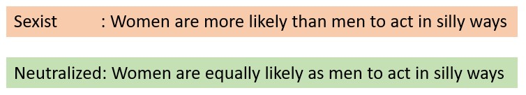

# Automatic Neutralisation of Sexist Language 

This repository contains all the code, data and pretrained models for our project on automatically neutralising sexist language.  

This project is built upon the works of Pryzant et. al (2019) [1] and using the “Call Me Sexist” dataset [2] to neutralise sexism. To the dataset, we have added 2,405 manually neutralised tweets. The model has been fine-tuned on this new version of the dataset. We also present two  new automatic evaluation methods; sentence embeddings and the use of a SVM based sexism classification model. In addition, we proposed an automated training data augmentation pipeline to improve our model further.

To run the code, please clone the repo and run demo.ipynb. Detailed instructions are provided in the notebook for running inference/training.

The repo is structured as follows:
- The **current** directory contains two python notebooks that can be run using Google Colab. The "NLP_Model" notebook contains the code to pre-process the data, fine tune the model, run inference and evaluate our models. The "Demo" notebook is a shorter version of the other notebook which can be used to demonstrate our code.  
- The **neutralizing-bias** folder contains the code for the pre-trained model created by Pryzant et. al (2019). The paper for this code can be found here: https://arxiv.org/pdf/1911.09709.pdf. This repository was used to fine tune and run inference on the models. We made some changes to the following files to work with our dataset:  
&nbsp;&nbsp;&nbsp;&nbsp;&nbsp;&nbsp; - harvest/gen_data_from_crawl.py  
&nbsp;&nbsp;&nbsp;&nbsp;&nbsp;&nbsp; - harvest/add_tags.py  
&nbsp;&nbsp;&nbsp;&nbsp;&nbsp;&nbsp; - src/shared/data.py 
    
* The **data folder** contains the raw and processed data for the models. This is broken up into train, test, augmented_data and human_eval folders. The train and test folders were used to fine tune the pre-trained model baseline, the augmented data was used to train a second fine tuned model and the human_eval data was used for manually evaluating the results of the baseline, fine tuned, and augmented data models. 

* The **baseline_model** folder contains the results of running inference on the baseline model created by Pryzant et. al (2019). 

* The **fine_tuned_model** folder contains the results of fine tuning the baseline model on the Call Me Sexist dataset. 

* The **augmented_data_model** folder contains of the second iteration of fine tuning the fine tuned model on another sexist dataset (in train1, train2 and train3). This second dataset is the Workplace Sexism Dataset introduced by Grosz et. al (2020) and the associated paper can be found here: https://arxiv.org/abs/2007.04181. The results of running inference on a test set from another sexist dataset is in the test folder. 

* The **demo folder** is used for the interactive part of the demo 
## References
[1] Reid Pryzant, Richard Diehl Martinez, Nathan Dass, Sadao Kurohashi, Dan Jurafsky, and Diyi Yang. 2020. Automatically neutralizing subjective bias in text. In
AAAI.  
[2] Mattia Samory, Indira Sen, Julian Kohne, Fabian Flöck, and Claudia Wagner. 2021. "call me sexist, but..." : Revisiting sexism detection using psychological
scales and adversarial samples. In ICWSM.
